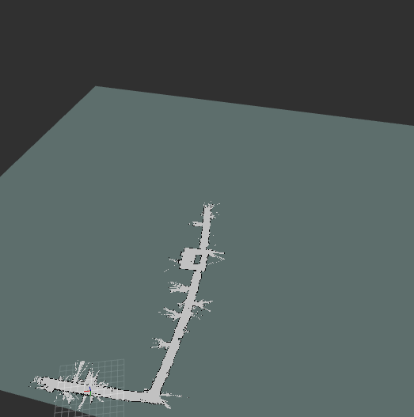
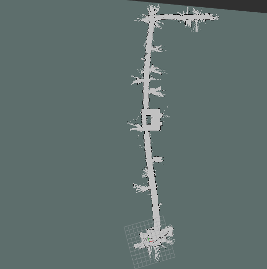

# Kudos ROS Package

This package provides SLAM functionality to kudos through the use of a neatoXV
Lidar.

ROS Package Dependencies
------------------------

The following ROS packages are needed to use kudos\_csh:

- tf
- hector\_mapping
- hector\_geotiff
- xv\_11\_laser\_driver

These packages can be installed with apt:

- sudo apt-get install ros-<distro>-xv-11-laser-driver
- sudo apt-get install ros-<distro>-hector-geotiff
- sudo apt-get install ros-<distro>-hector-mapping

Note: replace <distro> with the the appropriate ROS disto.

### Initial Mapping Results

Kudos was outfitter with Trevor Sherrard's
([@SherrardTr4129](https://github.com/sherrardTr4129)) neatoXV LiDAR.
The LiDAR was tethered to an laptoprunning this ROS package.
As the Robot was driven around floor a map was created as the robot localized
its position and pose. Some screenshots of the map in Rviz can be seen below.

